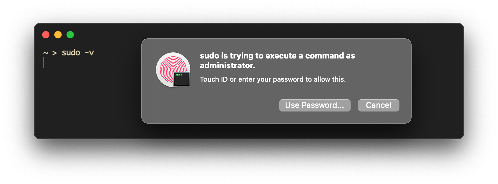

<div align="center">

# sudo-touchid

Automate adding [**TouchID**](https://support.apple.com/en-gb/guide/mac-help/mchl16fbf90a/mac) as sufficient root auth method <sup>for macOS</sup>
  


<sup>Just type <a href="https://git.io/sudotouchid"><code>git.io/sudotouchid</code></a> to go here.</sup>
            
</div>

## Try it out <sub> &nbsp; <sup> &nbsp; without installing</sup></sub>

```powershell
curl -sL raw.githubusercontent.com/artginzburg/sudo-touchid/main/sudo-touchid.sh | sh
```

> Now entering sudo mode is easier than ever, just like on GitHub — with TouchID in Terminal or whatever you're on

### Why?

Productivity — macOS _updates_ do _reset_ `/etc/pam.d/sudo`, so previously users had to _manually_ edit the file after each upgrade.

This tool was born to automate the process, allowing for TouchID sudo auth to be **quickly enabled** on a new/clean system.

<br />

## Install

### Via [🍺 Homebrew](https://brew.sh/)

```powershell
brew install artginzburg/tap/sudo-touchid
sudo brew services start sudo-touchid
```

> Check out [the formula](https://github.com/artginzburg/homebrew-tap/blob/main/Formula/sudo-touchid.rb) if you're interested

### Using `curl`

```powershell
curl -sL git.io/sudo-touchid | sh
```

> The one-liner above cares about everything outlined below for you — performing automated "manual" installation. But `brew install` is still the recommended way.

<br />

## What does it do?

`sudo-touchid.sh`:

- Adds `auth sufficient pam_tid.so` to the top of `/etc/pam.d/sudo` file (following [@cabel's advice](https://twitter.com/cabel/status/931292107372838912))

- Creates a backup file named `sudo.bak`.

`com.user.sudo-touchid.plist`:

- Runs `sudo-touchid.sh` on system reload

  > Needed because any following macOS updates just wipe out our custom `sudo`.

The installer:

- Saves `sudo-touchid.sh` as `/usr/local/bin/sudo-touchid` and gives it the permission to execute.

  > (yes, that also means you're able to run `sudo-touchid` from Terminal)

- Saves `com.user.sudo-touchid.plist` to `/Library/LaunchDaemons/` so that it's running on boot (requires root permission).

<br />

### Manual installation

1. Generally follow the steps provided by "The installer" above
2. If you need to, store `sudo-touchid.sh` anywhere else and replace `/usr/local/bin` in `com.user.sudo-touchid.plist` with the chosen path.

<br />

### Related

#### Disabling password prompt for `sudo`

- Change `%admin ALL=(ALL) ALL` to `%admin ALL=(ALL) NOPASSWD: ALL` in `/etc/sudoers`
